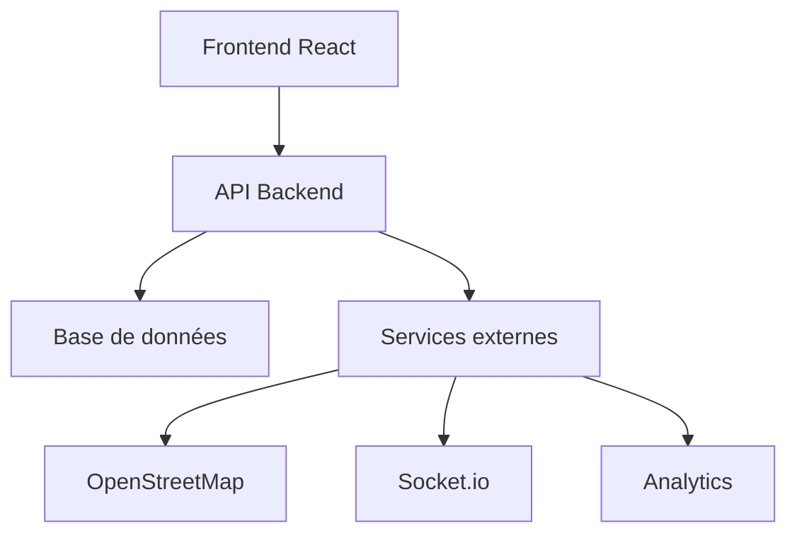

# Étape 10 : Documentation technique avec Docusaurus et Swagger

## Vue d'ensemble

Intégration d'un système de documentation technique complet utilisant Docusaurus (site de documentation statique) et Swagger (documentation API) pour fournir une documentation complète et interactive du projet Mosala Job Hub.

## Technologies utilisées

- **Docusaurus** : Framework React pour sites de documentation statiques
- **Swagger/OpenAPI** : Spécification et documentation d'API
- **Swagger UI** : Interface interactive pour tester les APIs
- **Redoc** : Documentation API alternative plus moderne

## Cas d'usage Mosala

1. **Documentation développeur** : Guide d'installation, configuration, API
2. **Documentation utilisateur** : Guides d'utilisation, tutoriels
3. **Documentation API** : Endpoints, modèles, exemples
4. **Documentation d'intégration** : Guides pour les partenaires
5. **Documentation de déploiement** : Procédures DevOps

## Installation et configuration

### 1. Documentation avec Docusaurus

#### Installation

```bash
# Créer le dossier de documentation
mkdir docs
cd docs

# Initialiser Docusaurus
npx create-docusaurus@latest mosala-docs classic --typescript

# Installer les dépendances
cd mosala-docs
npm install
```

#### Configuration de base

```javascript
// docs/mosala-docs/docusaurus.config.js
const config = {
  title: 'Mosala Job Hub',
  tagline: 'Documentation technique complète',
  url: 'https://docs.mosala.org',
  baseUrl: '/',
  onBrokenLinks: 'throw',
  onBrokenMarkdownLinks: 'warn',
  favicon: 'img/favicon.ico',
  organizationName: 'mosala',
  projectName: 'job-hub',
  
  presets: [
    [
      'classic',
      {
        docs: {
          sidebarPath: require.resolve('./sidebars.js'),
          editUrl: 'https://github.com/mosala/job-hub/edit/main/docs/',
        },
        blog: {
          showReadingTime: true,
          editUrl: 'https://github.com/mosala/job-hub/edit/main/docs/',
        },
        theme: {
          customCss: require.resolve('./src/css/custom.css'),
        },
      },
    ],
  ],
  
  themeConfig: {
    navbar: {
      title: 'Mosala Docs',
      logo: {
        alt: 'Mosala Logo',
        src: 'img/logo.svg',
      },
      items: [
        {
          type: 'docSidebar',
          sidebarId: 'tutorialSidebar',
          position: 'left',
          label: 'Documentation',
        },
        {to: '/blog', label: 'Blog', position: 'left'},
        {
          href: 'https://github.com/mosala/job-hub',
          label: 'GitHub',
          position: 'right',
        },
      ],
    },
    footer: {
      style: 'dark',
      links: [
        {
          title: 'Docs',
          items: [
            {
              label: 'Tutorial',
              to: '/docs/intro',
            },
          ],
        },
        {
          title: 'Community',
          items: [
            {
              label: 'Stack Overflow',
              href: 'https://stackoverflow.com/questions/tagged/mosala',
            },
            {
              label: 'Discord',
              href: 'https://discord.gg/mosala',
            },
          ],
        },
        {
          title: 'More',
          items: [
            {
              label: 'Blog',
              to: '/blog',
            },
            {
              label: 'GitHub',
              href: 'https://github.com/mosala/job-hub',
            },
          ],
        },
      ],
      copyright: `Copyright © ${new Date().getFullYear()} Mosala Job Hub. Built with Docusaurus.`,
    },
  },
};

module.exports = config;
```

#### Structure de la documentation

```bash
docs/mosala-docs/
├── docs/
│   ├── intro.md
│   ├── getting-started/
│   │   ├── installation.md
│   │   ├── configuration.md
│   │   └── quick-start.md
│   ├── api/
│   │   ├── authentication.md
│   │   ├── jobs.md
│   │   ├── formations.md
│   │   └── users.md
│   ├── deployment/
│   │   ├── docker.md
│   │   ├── kubernetes.md
│   │   └── production.md
│   └── integrations/
│       ├── openstreetmap.md
│       ├── socketio.md
│       └── analytics.md
├── src/
│   ├── components/
│   └── css/
└── static/
    └── img/
```

#### Exemple de page de documentation

```markdown
// docs/mosala-docs/docs/intro.md
---
sidebar_position: 1
---

# Introduction

Bienvenue dans la documentation technique de Mosala Job Hub, la plateforme d'emploi et de formation innovante pour l'Afrique.

## Vue d'ensemble

Mosala Job Hub est une plateforme complète qui combine :
- **Recrutement intelligent** : Matching automatique candidat-emploi
- **Formation certifiante** : Programmes adaptés au marché africain
- **Cartographie interactive** : Localisation des opportunités
- **Chat temps réel** : Support utilisateur intégré

## Architecture



## Technologies principales

- **Frontend** : React, TypeScript, Tailwind CSS
- **Backend** : Node.js, Express, TypeScript
- **Base de données** : PostgreSQL, Redis
- **Cartographie** : OpenStreetMap, Leaflet
- **Temps réel** : Socket.io
- **Analytics** : Plausible, PostHog

## Démarrage rapide

1. **Cloner le projet**
   ```bash
   git clone https://github.com/mosala/job-hub.git
   cd job-hub
   ```

2. **Installer les dépendances**
   ```bash
   npm install
   cd frontend && npm install
   cd ../backend && npm install
   ```

3. **Configurer l'environnement**
   ```bash
   cp .env.example .env
   # Éditer .env avec vos configurations
   ```

4. **Démarrer le développement**
   ```bash
   npm run dev
   ```

## Support

- 📧 Email : support@mosala.org
- 💬 Chat : Intégré dans l'application
- 📖 Documentation : docs.mosala.org
- 🐛 Issues : GitHub Issues
```

### 2. Documentation API avec Swagger

#### Installation des dépendances

```bash
# Backend
cd backend
npm install swagger-jsdoc swagger-ui-express @types/swagger-jsdoc @types/swagger-ui-express
```

#### Configuration Swagger

```typescript
// backend/src/config/swagger.ts
import swaggerJsdoc from 'swagger-jsdoc';
import swaggerUi from 'swagger-ui-express';

const options = {
  definition: {
    openapi: '3.0.0',
    info: {
      title: 'Mosala Job Hub API',
      version: '1.0.0',
      description: 'API complète pour la plateforme Mosala Job Hub',
      contact: {
        name: 'Support Mosala',
        email: 'support@mosala.org',
        url: 'https://mosala.org',
      },
      license: {
        name: 'MIT',
        url: 'https://opensource.org/licenses/MIT',
      },
    },
    servers: [
      {
        url: 'http://localhost:3001/api',
        description: 'Serveur de développement',
      },
      {
        url: 'https://api.mosala.org',
        description: 'Serveur de production',
      },
    ],
    components: {
      securitySchemes: {
        bearerAuth: {
          type: 'http',
          scheme: 'bearer',
          bearerFormat: 'JWT',
        },
      },
    },
    security: [
      {
        bearerAuth: [],
      },
    ],
  },
  apis: ['./src/routes/*.ts', './src/models/*.ts'],
};

const specs = swaggerJsdoc(options);

export { specs, swaggerUi };
```

#### Intégration dans Express

```typescript
// backend/src/app.ts
import express from 'express';
import { specs, swaggerUi } from './config/swagger';

const app = express();

// Documentation Swagger
app.use('/api-docs', swaggerUi.serve, swaggerUi.setup(specs, {
  customCss: '.swagger-ui .topbar { display: none }',
  customSiteTitle: 'Mosala Job Hub API',
  customfavIcon: '/favicon.ico',
}));

// Redoc (alternative plus moderne)
app.get('/api-docs-redoc', (req, res) => {
  res.send(`
    <!DOCTYPE html>
    <html>
      <head>
        <title>Mosala Job Hub API - ReDoc</title>
        <meta charset="utf-8"/>
        <meta name="viewport" content="width=device-width, initial-scale=1">
        <link href="https://fonts.googleapis.com/css?family=Montserrat:300,400,700|Roboto:300,400,700" rel="stylesheet">
        <style>
          body {
            margin: 0;
            padding: 0;
          }
        </style>
      </head>
      <body>
        <redoc spec-url="/api-docs/swagger.json"></redoc>
        <script src="https://cdn.jsdelivr.net/npm/redoc@next/bundles/redoc.standalone.js"></script>
      </body>
    </html>
  `);
});
```

#### Exemple de documentation d'endpoint

```typescript
// backend/src/routes/jobs.ts
/**
 * @swagger
 * components:
 *   schemas:
 *     Job:
 *       type: object
 *       required:
 *         - title
 *         - company
 *         - location
 *         - description
 *       properties:
 *         id:
 *           type: string
 *           description: ID unique du job
 *         title:
 *           type: string
 *           description: Titre du poste
 *         company:
 *           type: string
 *           description: Nom de l'entreprise
 *         location:
 *           type: string
 *           description: Localisation du poste
 *         description:
 *           type: string
 *           description: Description détaillée
 *         salary:
 *           type: string
 *           description: Fourchette de salaire
 *         type:
 *           type: string
 *           enum: [CDI, CDD, Stage, Freelance]
 *           description: Type de contrat
 *         tags:
 *           type: array
 *           items:
 *             type: string
 *           description: Tags associés
 *         createdAt:
 *           type: string
 *           format: date-time
 *         updatedAt:
 *           type: string
 *           format: date-time
 */

/**
 * @swagger
 * /jobs:
 *   get:
 *     summary: Récupérer tous les jobs
 *     description: Retourne la liste de tous les emplois disponibles
 *     tags: [Jobs]
 *     parameters:
 *       - in: query
 *         name: page
 *         schema:
 *           type: integer
 *           default: 1
 *         description: Numéro de page
 *       - in: query
 *         name: limit
 *         schema:
 *           type: integer
 *           default: 10
 *         description: Nombre d'éléments par page
 *       - in: query
 *         name: location
 *         schema:
 *           type: string
 *         description: Filtrer par localisation
 *       - in: query
 *         name: type
 *         schema:
 *           type: string
 *           enum: [CDI, CDD, Stage, Freelance]
 *         description: Filtrer par type de contrat
 *     responses:
 *       200:
 *         description: Liste des jobs récupérée avec succès
 *         content:
 *           application/json:
 *             schema:
 *               type: object
 *               properties:
 *                 jobs:
 *                   type: array
 *                   items:
 *                     $ref: '#/components/schemas/Job'
 *                 pagination:
 *                   type: object
 *                   properties:
 *                     page:
 *                       type: integer
 *                     limit:
 *                       type: integer
 *                     total:
 *                       type: integer
 *                     pages:
 *                       type: integer
 *       400:
 *         description: Paramètres de requête invalides
 *       500:
 *         description: Erreur serveur
 */
router.get('/', async (req, res) => {
  // Implémentation...
});

/**
 * @swagger
 * /jobs/{id}:
 *   get:
 *     summary: Récupérer un job par ID
 *     description: Retourne les détails d'un emploi spécifique
 *     tags: [Jobs]
 *     parameters:
 *       - in: path
 *         name: id
 *         required: true
 *         schema:
 *           type: string
 *         description: ID du job
 *     responses:
 *       200:
 *         description: Job récupéré avec succès
 *         content:
 *           application/json:
 *             schema:
 *               $ref: '#/components/schemas/Job'
 *       404:
 *         description: Job non trouvé
 *       500:
 *         description: Erreur serveur
 */
router.get('/:id', async (req, res) => {
  // Implémentation...
});

/**
 * @swagger
 * /jobs:
 *   post:
 *     summary: Créer un nouveau job
 *     description: Crée un nouvel emploi (nécessite authentification)
 *     tags: [Jobs]
 *     security:
 *       - bearerAuth: []
 *     requestBody:
 *       required: true
 *       content:
 *         application/json:
 *           schema:
 *             type: object
 *             required:
 *               - title
 *               - company
 *               - location
 *               - description
 *             properties:
 *               title:
 *                 type: string
 *               company:
 *                 type: string
 *               location:
 *                 type: string
 *               description:
 *                 type: string
 *               salary:
 *                 type: string
 *               type:
 *                 type: string
 *                 enum: [CDI, CDD, Stage, Freelance]
 *               tags:
 *                 type: array
 *                 items:
 *                   type: string
 *     responses:
 *       201:
 *         description: Job créé avec succès
 *         content:
 *           application/json:
 *             schema:
 *               $ref: '#/components/schemas/Job'
 *       400:
 *         description: Données invalides
 *       401:
 *         description: Non authentifié
 *       403:
 *         description: Non autorisé
 *       500:
 *         description: Erreur serveur
 */
router.post('/', authenticateToken, async (req, res) => {
  // Implémentation...
});
```

### 3. Documentation des intégrations

#### Page d'intégration OpenStreetMap

```markdown
// docs/mosala-docs/docs/integrations/openstreetmap.md
---
sidebar_position: 1
---

# Intégration OpenStreetMap et Leaflet

## Vue d'ensemble

L'intégration cartographique utilise OpenStreetMap pour les données géographiques et Leaflet pour l'affichage interactif.

## Configuration

### Variables d'environnement

```bash
# Frontend
REACT_APP_MAP_CENTER_LAT=-4.2634
REACT_APP_MAP_CENTER_LON=15.2429
REACT_APP_MAP_DEFAULT_ZOOM=10
REACT_APP_GEOCODING_ENABLED=true
```

### Installation des dépendances

```bash
cd frontend
npm install leaflet react-leaflet @types/leaflet
```

## Composants

### MapComponent

Composant principal pour l'affichage des cartes avec filtres et recherche.

```typescript
import MapComponent from '@/components/MapComponent';

<MapComponent 
  locations={jobLocations}
  center={[-4.2634, 15.2429]}
  zoom={10}
  height="500px"
  showSearch={true}
  showFilters={true}
/>
```

### InteractiveMap3D

Carte avancée avec géolocalisation et cercles de rayon.

```typescript
import InteractiveMap3D from '@/components/InteractiveMap3D';

<InteractiveMap3D />
```

## Services

### GeocodingService

Service pour la conversion d'adresses en coordonnées géographiques.

```typescript
import { GeocodingService } from '@/services/geocoding';

// Recherche d'adresse
const results = await GeocodingService.searchLocation('Brazzaville');

// Géocodage inverse
const address = await GeocodingService.reverseGeocode(-4.2634, 15.2429);

// Calcul de distance
const distance = await GeocodingService.getDistance(lat1, lon1, lat2, lon2);
```

## Utilisation

### Ajouter des marqueurs

```typescript
const locations = [
  {
    id: 'job-1',
    name: 'Développeur Full Stack',
    type: 'job',
    position: [-4.2634, 15.2429],
    description: 'Poste de développeur à Brazzaville',
    address: 'Brazzaville, République du Congo',
    contact: '+242 06 802 00 06',
    website: 'https://mosala.org'
  }
];
```

### Personnaliser les icônes

```typescript
const getIcon = (type: string) => {
  const colors = {
    job: '#7ED9A7',
    formation: '#FFD93D',
    service: '#FF6B35',
    office: '#00824B'
  };
  
  return new Icon({
    iconUrl: `data:image/svg+xml;base64,${btoa(`
      <svg width="25" height="41" viewBox="0 0 25 41" xmlns="http://www.w3.org/2000/svg">
        <path d="M12.5 0C5.6 0 0 5.6 0 12.5c0 7.9 12.5 28.5 12.5 28.5s12.5-20.6 12.5-28.5C25 5.6 19.4 0 12.5 0z" fill="${colors[type]}"/>
        <circle cx="12.5" cy="12.5" r="6" fill="white"/>
      </svg>
    `)}`,
    iconSize: [25, 41],
    iconAnchor: [12, 41]
  });
};
```

## Fonctionnalités avancées

### Géolocalisation

```typescript
import { useGeolocation } from '@/hooks/useGeolocation';

const { location, error, loading } = useGeolocation();

if (location) {
  // Utiliser la position de l'utilisateur
  setMapCenter(location);
}
```

### Calcul d'itinéraires

```typescript
import { RoutingService } from '@/services/routing';

const route = await RoutingService.getRoute(
  [userLat, userLon],
  [jobLat, jobLon]
);
```

## Déploiement

### Production

```bash
# Build de production
npm run build

# Variables d'environnement
REACT_APP_MAP_CENTER_LAT=-4.2634
REACT_APP_MAP_CENTER_LON=15.2429
REACT_APP_MAP_DEFAULT_ZOOM=10
```

### Performance

- Cache des tuiles automatique
- Chargement progressif
- Optimisation des marqueurs
- Compression des données

## Support

- 📖 [Documentation Leaflet](https://leafletjs.com/reference.html)
- 📖 [Documentation React-Leaflet](https://react-leaflet.js.org/)
- 🌐 [OpenStreetMap](https://www.openstreetmap.org/)
- 🔍 [Nominatim](https://nominatim.org/)
```

## Déploiement

### 1. Documentation Docusaurus

```bash
# Build de production
cd docs/mosala-docs
npm run build

# Déploiement sur GitHub Pages
npm run deploy
```

### 2. Configuration CI/CD

```yaml
# .github/workflows/docs.yml
name: Deploy Documentation

on:
  push:
    branches: [main]
    paths: ['docs/**']

jobs:
  deploy-docs:
    runs-on: ubuntu-latest
    steps:
      - uses: actions/checkout@v3
      
      - name: Setup Node.js
        uses: actions/setup-node@v3
        with:
          node-version: '18'
          
      - name: Install dependencies
        run: |
          cd docs/mosala-docs
          npm install
          
      - name: Build documentation
        run: |
          cd docs/mosala-docs
          npm run build
          
      - name: Deploy to GitHub Pages
        uses: peaceiris/actions-gh-pages@v3
        with:
          github_token: ${{ secrets.GITHUB_TOKEN }}
          publish_dir: ./docs/mosala-docs/build
```

### 3. Configuration Nginx

```nginx
# /etc/nginx/sites-available/docs.mosala.org
server {
    listen 80;
    server_name docs.mosala.org;
    
    location / {
        root /var/www/docs.mosala.org;
        index index.html;
        try_files $uri $uri/ /index.html;
    }
    
    # Cache pour les assets statiques
    location ~* \.(js|css|png|jpg|jpeg|gif|ico|svg)$ {
        expires 1y;
        add_header Cache-Control "public, immutable";
    }
}
```

## Tests

### Test de la documentation

```bash
# Démarrer Docusaurus en mode développement
cd docs/mosala-docs
npm start

# Tester sur http://localhost:3000
```

### Test de l'API Swagger

```bash
# Démarrer le backend
cd backend
npm run dev

# Tester sur http://localhost:3001/api-docs
```

## Avantages

### ✅ Documentation complète
- Guide d'installation détaillé
- Documentation API interactive
- Exemples de code
- Tutoriels pas à pas

### ✅ Interface moderne
- Design responsive
- Navigation intuitive
- Recherche intégrée
- Thème personnalisable

### ✅ Maintenance facile
- Markdown simple
- Versioning automatique
- Intégration Git
- Déploiement automatisé

## Prochaines étapes

1. **Automatisation** avec n8n
2. **Monitoring avancé** des APIs
3. **Tests automatisés** de la documentation
4. **Intégration continue** des exemples

## Ressources

- [Documentation Docusaurus](https://docusaurus.io/docs)
- [Documentation Swagger](https://swagger.io/docs/)
- [OpenAPI Specification](https://swagger.io/specification/)
- [ReDoc](https://github.com/Redocly/redoc)

---

**Statut** : ✅ Prêt à être implémenté
**Prochaine étape** : [Automatisation avec n8n](./11-automatisation-n8n.md) 